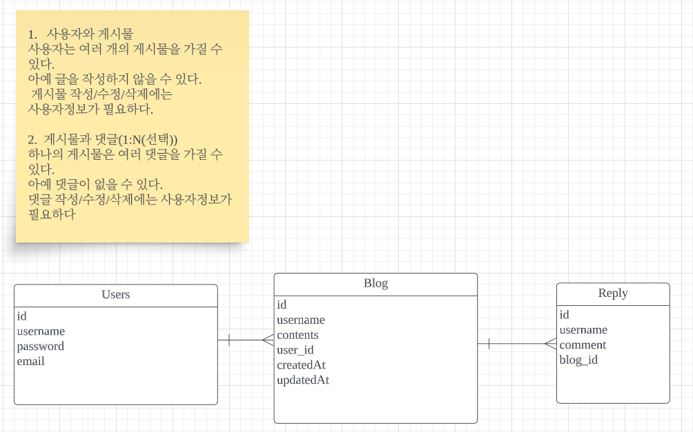

# API명세

| Method  | URL                         | Request                                                                                  | Response                                                                                                                                                                                                 | Description |
|---------|-----------------------------|------------------------------------------------------------------------------------------|----------------------------------------------------------------------------------------------------------------------------------------------------------------------------------------------------------|-------------|
| GET     | /api/blogs                  | -                                                                                        | { "id": 5, "title": "제목", "contents": "작성내용" }                                                                                                                                               | 전체 게시글 조회   |
| GET     | /api/blogs/{blogId}         | -                                                                                        | { "id": 5, "title": "제목", "contents": "작성내용" "username":"로그인ID", "createdAt": "2023-06-29T11:10:27.2715477", "modifiedAt": "2023-06-29T11:10:27.2715477" }                          | 선택 게시글 조회   |
| POST    | /api/blogs                  | { "title":"제목", "contents:"작성내용" }                                              | { "id": 6, "title": "제목", "contents": "작성내용" "username":"로그인ID", "createdAt": "2023-06-29T11:10:27.2715477", "modifiedAt": "2023-06-29T11:10:27.2715477" }                          | 게시글 작성      |
| PUT     | /api/blogs{blogId}          | { "title":"변경할 제목", "contents:"변경할 작성내용" }                                      | { "id": 6, "title": "변경할 제목", "contents": "변경할 작성내용" "username":"로그인ID", "createdAt": "2023-06-29T11:10:27.2715477", "modifiedAt": "2023-06-29T11:11:14.2715477" }                  | 게시글 수정      |
| DELETE  | /api/blogs/{blogId}         | -                                                                                        | "삭제 완료되었습니다."                                                                                                                                                                                            | 게시글 삭제      |
| POST    | /api/user/signup            | { "username":"woojin123", "password":"12345678", "email":"dnwls@gmail.com" } | "회원가입 완료"                                                                                                                                                                                                | 회원가입        |        
| POST    | /api/user/login             | { "username":"woojin123", "password":"12345678" }                               | "Login successed"                                                                                                                                                                                        | 로그인         |
| GET     | /api/blogs/{blogId}/replies | -                                                                                        | [{ "id": 6, "username": "woojin1", "comment": "댓글내용", "createdAt": "2023-06-29T16:29:43.220108", "modifiedAt": "2023-06-29T16:29:43.220108" }                                    | 댓글조회        |
| POST    | /api/blogs/{blogId}/replies | { "comment":"작성할 내용" }                                                           | {     "id": 8,     "blogId": 3,     "username": "testg",     "comment": "작성할 내용",     "createdAt": "2023-06-29T17:32:56.3167932",     "modifiedAt": "2023-06-29T17:32:56.3167932" } | 댓글 작성       |
| PUT     | /api/blogs/{blogId}/replies/{replyId}| { "comment":"수정할 내용" }                                                           | { "id": 8, "blogId": 3, "username": "testg" ,"comment": "수정할내용" ,"createdAt": "2023-06-29T17:32:56.316793", "modifiedAt": "2023-06-29T17:32:56.316793" }                                | 댓글 수정       |
| DELETE  | /api/blogs/{blogId}/replies/{replyId}| -                                                                                        |blogId+"번 게시물의"+replyId+"번째 댓글 삭제 완료"|댓글 삭제|

# ER다이어그램

